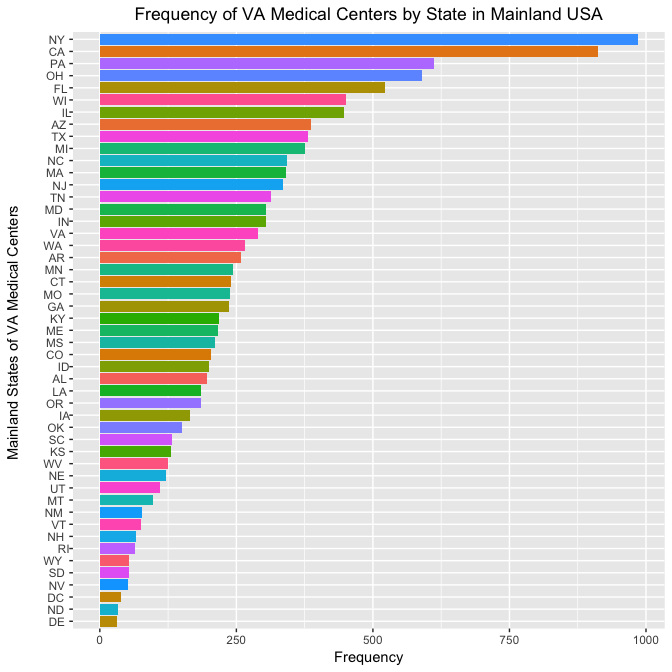
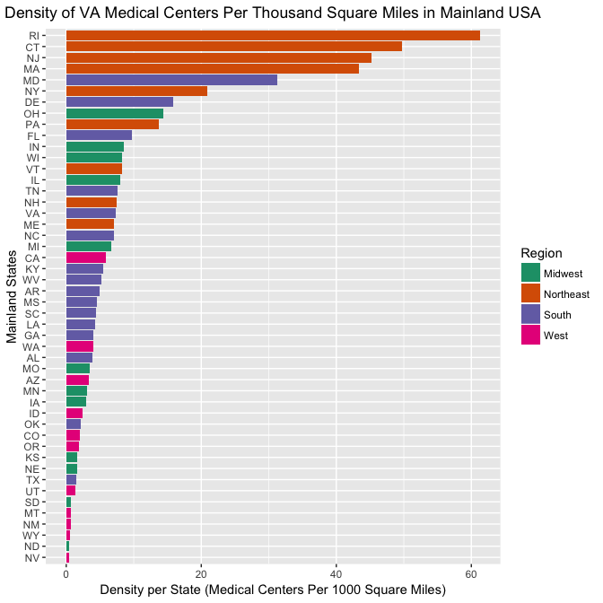

```r
library("rvest")
library("dplyr")
library("data.table")
library("ggplot2")
```

<center><h1>Question 1: Mental Health Clinics</h1></center>

### a. Load Data

```r
load("N-MHSS-2015-DS0001-data-r.rda")
mh2015_puf <- data.frame(mh2015_puf)
```

### b. State Abbreviations

```r
levels(unique(mh2015_puf$LST))
```

```
##  [1] "AK    " "AL    " "AR    " "AS    " "AZ    " "CA    " "CO    "
##  [8] "CT    " "DC    " "DE    " "FL    " "GA    " "GU    " "HI    "
## [15] "IA    " "ID    " "IL    " "IN    " "KS    " "KY    " "LA    "
## [22] "MA    " "MD    " "ME    " "MI    " "MN    " "MO    " "MS    "
## [29] "MT    " "NC    " "ND    " "NE    " "NH    " "NJ    " "NM    "
## [36] "NV    " "NY    " "OH    " "OK    " "OR    " "PA    " "PR    "
## [43] "RI    " "SC    " "SD    " "TN    " "TX    " "UT    " "VA    "
## [50] "VI    " "VT    " "WA    " "WI    " "WV    " "WY    "
```

### c. Mainland Locations

```r
omitted <- c('AK','HI','VI','PR','PW','MP','MH','GU','FM','AS')
mainlandStates <- mh2015_puf %>% filter(!trimws(as.character(LST)) %in% omitted)
stateSummary <- mainlandStates %>% group_by(LST) %>% summarise(FREQUENCY = n()) %>% data.frame()
colnames(stateSummary)[1] <- "STATE"
stateSummary
```

```
##     STATE FREQUENCY
## 1  AL           197
## 2  AR           259
## 3  AZ           386
## 4  CA           913
## 5  CO           203
## 6  CT           241
## 7  DC            38
## 8  DE            31
## 9  FL           523
## 10 GA           236
## 11 IA           166
## 12 ID           199
## 13 IL           447
## 14 IN           304
## 15 KS           130
## 16 KY           218
## 17 LA           186
## 18 MA           340
## 19 MD           305
## 20 ME           217
## 21 MI           375
## 22 MN           243
## 23 MO           238
## 24 MS           210
## 25 MT            97
## 26 NC           342
## 27 ND            33
## 28 NE           122
## 29 NH            67
## 30 NJ           335
## 31 NM            77
## 32 NV            52
## 33 NY           985
## 34 OH           589
## 35 OK           150
## 36 OR           185
## 37 PA           612
## 38 RI            64
## 39 SC           132
## 40 SD            54
## 41 TN           314
## 42 TX           382
## 43 UT           111
## 44 VA           289
## 45 VT            76
## 46 WA           266
## 47 WI           451
## 48 WV           124
## 49 WY            54
```

### d. Frequency Plot

```r
ggplot(data=stateSummary, aes(reorder(STATE, FREQUENCY),FREQUENCY)) +
  geom_bar(stat="identity", aes(fill=STATE))+ 
  ggtitle('Frequency of VA Medical Centers by State in Mainland USA') + coord_flip() +
  xlab('Mainland States of VA Medical Centers ') +
  ylab('Frequency') +
  theme(plot.title=element_text(hjust = .5)) +
  theme(axis.text.y = element_text(hjust=2)) + theme(legend.position="none")
```

<!-- -->

<center><h1>Question 2: Cleaning and Bringing In New Features</h1></center>

### a. Try to Merge

```r
# The problem is that there are extra spaces in the State abbreviation names in the stateSummary dataframe. This causes the frequencies to be null.

statesize <- read.csv(file="statesize.csv", header=TRUE, sep=",")
colnames(stateSummary)[1] <- "Abbrev"
merge(stateSummary, statesize, by="Abbrev", all.y=TRUE)
```

```
##    Abbrev FREQUENCY      StateName SqMiles    Region
## 1      AK        NA         Alaska  570374      West
## 2      AL        NA        Alabama   50750     South
## 3      AR        NA       Arkansas   52075     South
## 4      AZ        NA        Arizona  113642      West
## 5      CA        NA     California  155973      West
## 6      CO        NA       Colorado  103730      West
## 7      CT        NA    Connecticut    4845 Northeast
## 8      DE        NA       Delaware    1955     South
## 9      FL        NA        Florida   53997     South
## 10     GA        NA        Georgia   57919     South
## 11     HI        NA         Hawaii    6423      West
## 12     IA        NA           Iowa   55875   Midwest
## 13     ID        NA          Idaho   82751      West
## 14     IL        NA       Illinois   55593   Midwest
## 15     IN        NA        Indiana   35870   Midwest
## 16     KS        NA         Kansas   81823   Midwest
## 17     KY        NA       Kentucky   39732     South
## 18     LA        NA      Louisiana   43566     South
## 19     MA        NA  Massachusetts    7838 Northeast
## 20     MD        NA       Maryland    9775     South
## 21     ME        NA          Maine   30865 Northeast
## 22     MI        NA       Michigan   56539   Midwest
## 23     MN        NA      Minnesota   79617   Midwest
## 24     MO        NA       Missouri   68898   Midwest
## 25     MS        NA    Mississippi   46914     South
## 26     MT        NA        Montana  145556      West
## 27     NC        NA North Carolina   48718     South
## 28     ND        NA   North Dakota   68994   Midwest
## 29     NE        NA       Nebraska   76878   Midwest
## 30     NH        NA  New Hampshire    8969 Northeast
## 31     NJ        NA     New Jersey    7419 Northeast
## 32     NM        NA     New Mexico  121365      West
## 33     NV        NA         Nevada  109806      West
## 34     NY        NA       New York   47224 Northeast
## 35     OH        NA           Ohio   40953   Midwest
## 36     OK        NA       Oklahoma   68679     South
## 37     OR        NA         Oregon   96003      West
## 38     PA        NA   Pennsylvania   44820 Northeast
## 39     RI        NA   Rhode Island    1045 Northeast
## 40     SC        NA South Carolina   30111     South
## 41     SD        NA   South Dakota   75898   Midwest
## 42     TN        NA      Tennessee   41220     South
## 43     TX        NA          Texas  261914     South
## 44     UT        NA           Utah   82168      West
## 45     VA        NA       Virginia   39598     South
## 46     VT        NA        Vermont    9249 Northeast
## 47     WA        NA     Washington   66582      West
## 48     WI        NA      Wisconsin   54314   Midwest
## 49     WV        NA  West Virginia   24087     South
## 50     WY        NA        Wyoming   97105      West
```

### b. Fix and Merge

```r
stateSummary$Abbrev = gsub(' ','',stateSummary$Abbrev)
merged <- merge(stateSummary, statesize, by="Abbrev")
merged
```

```
##    Abbrev FREQUENCY      StateName SqMiles    Region
## 1      AL       197        Alabama   50750     South
## 2      AR       259       Arkansas   52075     South
## 3      AZ       386        Arizona  113642      West
## 4      CA       913     California  155973      West
## 5      CO       203       Colorado  103730      West
## 6      CT       241    Connecticut    4845 Northeast
## 7      DE        31       Delaware    1955     South
## 8      FL       523        Florida   53997     South
## 9      GA       236        Georgia   57919     South
## 10     IA       166           Iowa   55875   Midwest
## 11     ID       199          Idaho   82751      West
## 12     IL       447       Illinois   55593   Midwest
## 13     IN       304        Indiana   35870   Midwest
## 14     KS       130         Kansas   81823   Midwest
## 15     KY       218       Kentucky   39732     South
## 16     LA       186      Louisiana   43566     South
## 17     MA       340  Massachusetts    7838 Northeast
## 18     MD       305       Maryland    9775     South
## 19     ME       217          Maine   30865 Northeast
## 20     MI       375       Michigan   56539   Midwest
## 21     MN       243      Minnesota   79617   Midwest
## 22     MO       238       Missouri   68898   Midwest
## 23     MS       210    Mississippi   46914     South
## 24     MT        97        Montana  145556      West
## 25     NC       342 North Carolina   48718     South
## 26     ND        33   North Dakota   68994   Midwest
## 27     NE       122       Nebraska   76878   Midwest
## 28     NH        67  New Hampshire    8969 Northeast
## 29     NJ       335     New Jersey    7419 Northeast
## 30     NM        77     New Mexico  121365      West
## 31     NV        52         Nevada  109806      West
## 32     NY       985       New York   47224 Northeast
## 33     OH       589           Ohio   40953   Midwest
## 34     OK       150       Oklahoma   68679     South
## 35     OR       185         Oregon   96003      West
## 36     PA       612   Pennsylvania   44820 Northeast
## 37     RI        64   Rhode Island    1045 Northeast
## 38     SC       132 South Carolina   30111     South
## 39     SD        54   South Dakota   75898   Midwest
## 40     TN       314      Tennessee   41220     South
## 41     TX       382          Texas  261914     South
## 42     UT       111           Utah   82168      West
## 43     VA       289       Virginia   39598     South
## 44     VT        76        Vermont    9249 Northeast
## 45     WA       266     Washington   66582      West
## 46     WI       451      Wisconsin   54314   Midwest
## 47     WV       124  West Virginia   24087     South
## 48     WY        54        Wyoming   97105      West
```

### c. Add Hospitals Per Thousand Square Miles

```r
merged$MedCentersPerThsdSqMiles <- merged$FREQUENCY/(merged$SqMiles/1000)
head(merged, 10)
```

```
##    Abbrev FREQUENCY   StateName SqMiles    Region MedCentersPerThsdSqMiles
## 1      AL       197     Alabama   50750     South                 3.881773
## 2      AR       259    Arkansas   52075     South                 4.973596
## 3      AZ       386     Arizona  113642      West                 3.396632
## 4      CA       913  California  155973      West                 5.853577
## 5      CO       203    Colorado  103730      West                 1.957004
## 6      CT       241 Connecticut    4845 Northeast                49.742002
## 7      DE        31    Delaware    1955     South                15.856777
## 8      FL       523     Florida   53997     South                 9.685723
## 9      GA       236     Georgia   57919     South                 4.074656
## 10     IA       166        Iowa   55875   Midwest                 2.970917
```

### d. Frequency Plot for Hospitals Per Thousand Square Miles

```r
ggplot(data = merged, aes(reorder(Abbrev, MedCentersPerThsdSqMiles), MedCentersPerThsdSqMiles)) +
  geom_bar(stat="identity", aes(fill = Region)) + 
  ggtitle('Density of VA Medical Centers Per Thousand Square Miles in Mainland USA') + coord_flip() +
  scale_fill_brewer(palette="Dark2") +
  xlab('Mainland States') +
  ylab('Density per State (Medical Centers Per 1000 Square Miles)') +
  theme(plot.title=element_text(hjust = .5)) +
  theme(axis.text.y = element_text(hjust=1))
```

<!-- -->

### e. What patterns are seen?

Smaller states have higher frequencies of medical centers per thousand miles while larger states tend to have smaller frequencies. The Northeast appears to have a high frequency while the West appears to have the lowest frequency. I would request to my boss that we address looking at population density and creating an aggregate metric that weights the frequency based on distance with the frequency based on population.

Github link: https://github.com/mihir787/msds_homework/tree/master/assignment10_exploratory_data
