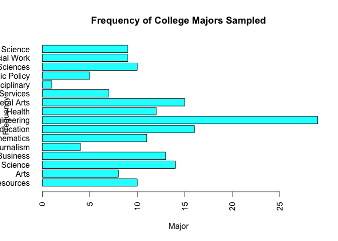

#Fivethirtyeight Data

```r
library(fivethirtyeight)

#find string name of eighteenth data set
eighteenthItem <- data(package = "fivethirtyeight")$results[18,][3][[1]]

#evaluate the string which returns the data set and set it to df
df <- eval(as.name(eighteenthItem))

#find url => vignette("fivethirtyeight", package = "fivethirtyeight")
#http://fivethirtyeight.com/features/the-economic-guide-to-picking-a-college-major/

#dimensions of set
dim(df)
```

```
## [1] 173  21
```

```r
#column names of set
names(df)
```

```
##  [1] "rank"                        "major_code"                 
##  [3] "major"                       "major_category"             
##  [5] "total"                       "sample_size"                
##  [7] "men"                         "women"                      
##  [9] "sharewomen"                  "employed"                   
## [11] "employed_fulltime"           "employed_parttime"          
## [13] "employed_fulltime_yearround" "unemployed"                 
## [15] "unemployment_rate"           "p25th"                      
## [17] "median"                      "p75th"                      
## [19] "college_jobs"                "non_college_jobs"           
## [21] "low_wage_jobs"
```

#Data Summary 

```r
#column names
names(df)
```

```
##  [1] "rank"                        "major_code"                 
##  [3] "major"                       "major_category"             
##  [5] "total"                       "sample_size"                
##  [7] "men"                         "women"                      
##  [9] "sharewomen"                  "employed"                   
## [11] "employed_fulltime"           "employed_parttime"          
## [13] "employed_fulltime_yearround" "unemployed"                 
## [15] "unemployment_rate"           "p25th"                      
## [17] "median"                      "p75th"                      
## [19] "college_jobs"                "non_college_jobs"           
## [21] "low_wage_jobs"
```

```r
#number of columns
ncol(df)
```

```
## [1] 21
```

```r
#frequency table of majors
major_count <- table(df$major_category)

#plot
par(las=2)
barplot(major_count, xlab = "Major", ylab = "Frequency", main = "Frequency of College Majors Sampled", horiz=TRUE, col=c("cyan"))
```

<!-- -->

```r
#write csv file of college_recent_grads data
write.csv(df, file = "college_recent_grads.csv",row.names=FALSE)
```
