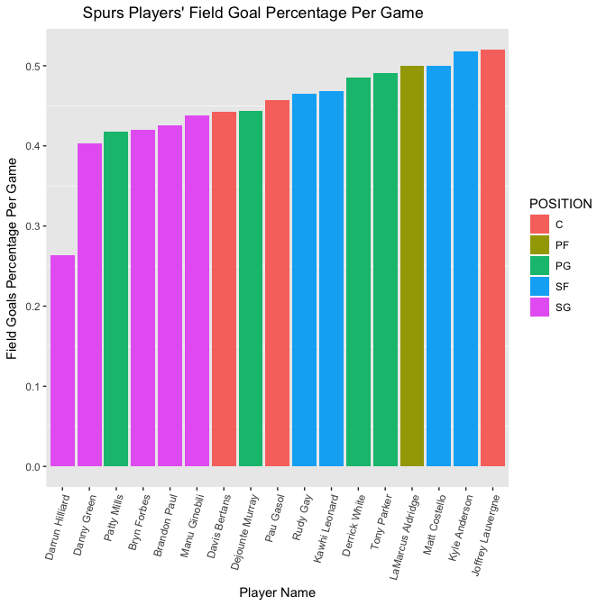

```r
library("rvest")
library("dplyr")
library("data.table")
library("ggplot2")
```

<center><h1>Question 1: Harry Potter Cast</h1></center>

### Scrape the Cast Table

```r
hp <- read_html("http://www.imdb.com/title/tt1201607/fullcredits?ref_=tt_ql_1")
hpTable <- hp %>% html_nodes(".cast_list") %>% html_table()
df <- data.frame(hpTable)
```

### Clean the Cast Dataframe

```r
# Remove extra columns that do not have relevant information
dfCleaned <- df[,c("X2","X4")][-c(1),]

# Change name of the remaining columns
names(dfCleaned)[1] <- "Actor"
names(dfCleaned)[2] <- "Character"

# Remove row that has value of "Rest of cast listed alphabetically:"
dfCleaned <- dfCleaned %>% filter(!(Actor == "Rest of cast listed alphabetically:")) 

# Clean character value for actor Warwick
warwickRow <- dfCleaned %>% filter(Actor %like% "Warwick")
dfCleaned[which(dfCleaned$Actor == warwickRow$Actor), ]$Character <- "Griphook / Professor Filius Flitwick"

# Remove new line escape characters
dfCleaned$Character <- gsub("\n", "", dfCleaned$Character)

# Create FirstName and Surname columns with default NA value
dfCleaned$FirstName <- NA
dfCleaned$Surname <- NA
```

### Separate the Firstname and Surname from the Actor value

```r
# Split out actor name parts. The last name value separated by a space becomes the Surname.
# The rest of the name is included in the FirstName.
for (row in 1:nrow(dfCleaned)) {
  actor <- dfCleaned[row, "Actor"]
  actorNameParts <- strsplit(actor, " ")[[1]]
  actorNameParts
  if(length(actorNameParts) > 2) {
    dfCleaned[row,]$FirstName <- paste(actorNameParts[1:(length(actorNameParts) - 1) ] , collapse=" ")
    dfCleaned[row,]$Surname <- actorNameParts[length(actorNameParts)]
  } else {
    dfCleaned[row,]$FirstName <- actorNameParts[1]
    dfCleaned[row,]$Surname <- actorNameParts[2]
  }
}

# Select the desired columns
dfCleaned <- dfCleaned[,c("FirstName", "Surname", "Character")]
```

### First Ten Rows of Table

```r
head(dfCleaned, 10)
```

```
##    FirstName   Surname                            Character
## 1      Ralph   Fiennes                       Lord Voldemort
## 2    Michael    Gambon           Professor Albus Dumbledore
## 3       Alan   Rickman              Professor Severus Snape
## 4     Daniel Radcliffe                         Harry Potter
## 5     Rupert     Grint                          Ron Weasley
## 6       Emma    Watson                     Hermione Granger
## 7     Evanna     Lynch                        Luna Lovegood
## 8   Domhnall   Gleeson                         Bill Weasley
## 9   Clémence     Poésy                       Fleur Delacour
## 10   Warwick     Davis Griphook / Professor Filius Flitwick
```

<center><h1>Question 2: SportsBall</h1></center>

### Scrape Shooting Statistics Table

```r
#use xpath to target correct table
espnUrl <- "http://www.espn.com/nba/team/stats/_/name/sa/san-antonio-spurs"

shootingStats <- espnUrl %>%
  read_html() %>%
  html_nodes(xpath='//*[@id="my-players-table"]/div[3]/div[3]/table') %>%
  html_table()
```

### Clean Shooting Statistics Table

```r
# Remove extra top row and bottom row with Totals and set as Data Frame
shootingStats <- shootingStats[[1]] %>% tail(-1) %>% head(-1) %>% data.frame 

# Set the first row which is header labels as the colnames. Then remove the row.
colnames(shootingStats) <- shootingStats[1, ]
shootingStats <- shootingStats[-1, ]

# Create POSITION and NAME columns and set them to NA
shootingStats$POSITION <- NA
shootingStats$NAME <- NA

# Split the PLAYER value for each row by a ','. Set the first portion of the split to the NAME and 
# the second to the POSITION.
for (row in 1:nrow(shootingStats)) {
  playerRow <- shootingStats[row,]
  split <- unlist(strsplit(playerRow$PLAYER, "[,]"))
  playerRow$NAME <- split[1]
  playerRow$POSITION <- split[2]
  shootingStats[row,] <- playerRow
}

# Move the POSITION and NAME columns to the front of the dataframe. Exclude the PLAYER column now that it has been split.
shootingStats <- shootingStats[, c(16:17, 2:15)]

# Check data type of all columns
sapply(shootingStats, class)
```

```
##    POSITION        NAME         FGM         FGA         FG%         3PM 
## "character" "character" "character" "character" "character" "character" 
##         3PA         3P%         FTM         FTA         FT%         2PM 
## "character" "character" "character" "character" "character" "character" 
##         2PA         2P%         PPS        AFG% 
## "character" "character" "character" "character"
```

```r
# Convert numeric columns to numeric types
columnsToConvert <- colnames(shootingStats)[c(-1, -2)]
for (i in 1:length(columnsToConvert)) {
  columnName <- columnsToConvert[i]
  columnNumber <- which(colnames(shootingStats) == columnName)
  shootingStats[, columnNumber] <- as.numeric(shootingStats[, columnNumber])
}

# Display the Class of the column types after conversion
sapply(shootingStats, class)
```

```
##    POSITION        NAME         FGM         FGA         FG%         3PM 
## "character" "character"   "numeric"   "numeric"   "numeric"   "numeric" 
##         3PA         3P%         FTM         FTA         FT%         2PM 
##   "numeric"   "numeric"   "numeric"   "numeric"   "numeric"   "numeric" 
##         2PA         2P%         PPS        AFG% 
##   "numeric"   "numeric"   "numeric"   "numeric"
```

### Bar Chart of FG% Per Game

```r
ggplot(shootingStats, aes(reorder(NAME, `FG%`),`FG%`)) + geom_bar(stat="identity", aes(fill=POSITION)) +
  ggtitle("Spurs Players' Field Goal Percentage Per Game") +
  ylab('Field Goals Percentage Per Game')	+ xlab('Player Name') +
  theme(plot.title=element_text(hjust = .3)) +
  theme(axis.text.x = element_text(angle=75,hjust=1), panel.grid.major = element_blank())
```

<!-- -->

Github link: https://github.com/mihir787/msds_homework/tree/master/assignment9_preparing_data
